# n=9 Step-2 untouched triangulation components — readable

This file prints the four Step-2 components that the depth-1 fingerprint matrix on the 90-orbit cluster does NOT bridge, and that the depth-1 fingerprints of the 23 non-cluster non-tri orbits do not bridge either (TEST 1 result).

Components: **[1, 3, 7, 14]**

Each component below lists its triangulation orbits (canonical reps), Step-2 swap edges within the component, structural features, and ASCII / PNG diagrams of one representative per orbit.


## Component 1

Orbits in component: **[1, 2, 27, 45]** (4 orbits)

### Triangulation orbit representatives

| Orbit ID | Rep (chord set) | Stabilizer order | Chord lengths | Ear vertices |
|---:|---|---:|---|---|
| 1 | {(1,3), (1,4), (1,5), (1,6), (1,7), (1,8)} | 1 | [2, 2, 3, 3, 4, 4] | [2, 9] |
| 2 | {(1,3), (1,4), (1,5), (1,6), (1,7), (7,9)} | 1 | [2, 2, 3, 3, 4, 4] | [2, 8] |
| 27 | {(1,3), (1,4), (4,7), (4,8), (4,9), (5,7)} | 1 | [2, 2, 3, 3, 4, 4] | [2, 6] |
| 45 | {(1,3), (3,6), (3,7), (3,8), (3,9), (4,6)} | 1 | [2, 2, 3, 3, 4, 4] | [2, 5] |

### Step-2 swap edges *within* component 1

Each row gives one orbit-level Step-2 edge: two triangulation orbits whose representatives are related by a single bare/special swap at some cyclic zone(s). Any two orbits in this component are linked by a chain of such edges.

| Orbit A | Orbit B | Sample triangulation pair (at zones) |
|---:|---:|---|
| 1 | 2 | `{(1,7),(2,7),(3,7),(4,6),(4,7),(7,9)}` ↔ `{(1,7),(2,7),(3,7),(4,7),(5,7),(7,9)}` (zones [5, 5]) |
| 1 | 45 | `{(1,3),(1,4),(1,5),(1,6),(1,7),(1,8)}` ↔ `{(1,4),(1,5),(1,6),(1,7),(1,8),(2,4)}` (zones [2, 2]) |
| 2 | 27 | `{(1,6),(2,6),(3,5),(3,6),(6,9),(7,9)}` ↔ `{(1,6),(2,6),(3,5),(3,6),(6,8),(6,9)}` (zones [7, 7]) |
| 27 | 45 | `{(1,3),(3,6),(3,7),(3,8),(3,9),(4,6)}` ↔ `{(2,9),(3,6),(3,7),(3,8),(3,9),(4,6)}` (zones [1, 1]) |

### Diagrams


### Orbit 1
```
9-gon vertex layout (cyclic):
        1
    9       2
  8           3
  7           4
    6       5
        
Chords in T (with cyclic length):
    (1,3)  length = 2
    (1,4)  length = 3
    (1,5)  length = 4
    (1,6)  length = 4
    (1,7)  length = 3
    (1,8)  length = 2
Ear vertices (no chord touches): [2, 9]
```

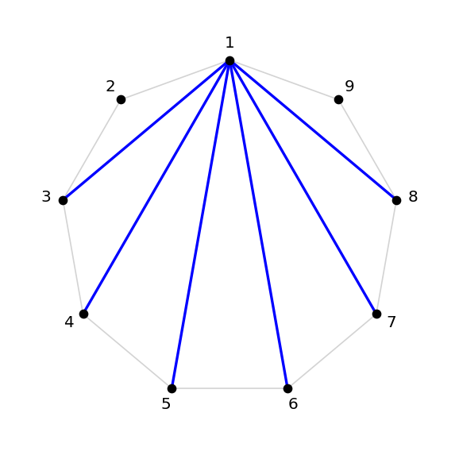


### Orbit 2
```
9-gon vertex layout (cyclic):
        1
    9       2
  8           3
  7           4
    6       5
        
Chords in T (with cyclic length):
    (1,3)  length = 2
    (1,4)  length = 3
    (1,5)  length = 4
    (1,6)  length = 4
    (1,7)  length = 3
    (7,9)  length = 2
Ear vertices (no chord touches): [2, 8]
```

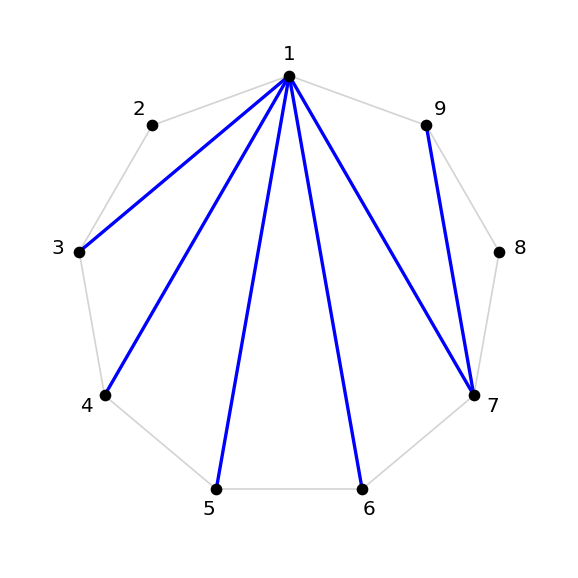


### Orbit 27
```
9-gon vertex layout (cyclic):
        1
    9       2
  8           3
  7           4
    6       5
        
Chords in T (with cyclic length):
    (1,3)  length = 2
    (1,4)  length = 3
    (4,7)  length = 3
    (4,8)  length = 4
    (4,9)  length = 4
    (5,7)  length = 2
Ear vertices (no chord touches): [2, 6]
```

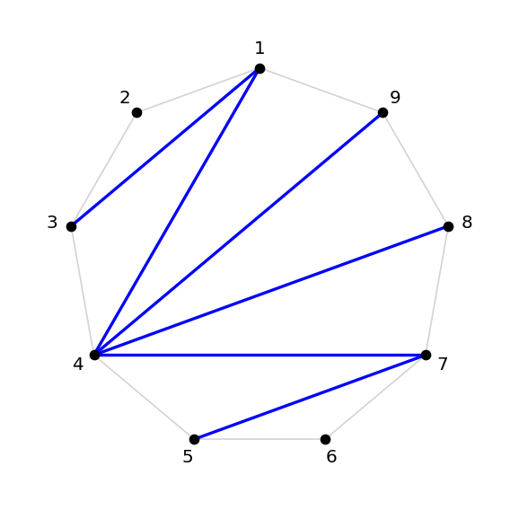


### Orbit 45
```
9-gon vertex layout (cyclic):
        1
    9       2
  8           3
  7           4
    6       5
        
Chords in T (with cyclic length):
    (1,3)  length = 2
    (3,6)  length = 3
    (3,7)  length = 4
    (3,8)  length = 4
    (3,9)  length = 3
    (4,6)  length = 2
Ear vertices (no chord touches): [2, 5]
```

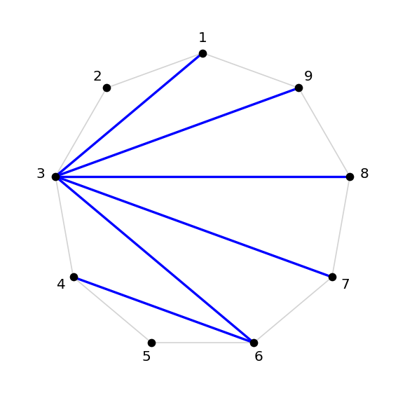


## Component 3

Orbits in component: **[4, 5, 11, 49]** (4 orbits)

### Triangulation orbit representatives

| Orbit ID | Rep (chord set) | Stabilizer order | Chord lengths | Ear vertices |
|---:|---|---:|---|---|
| 4 | {(1,3), (1,4), (1,5), (1,6), (6,8), (6,9)} | 1 | [2, 2, 3, 3, 4, 4] | [2, 7] |
| 5 | {(1,3), (1,4), (1,5), (1,6), (6,9), (7,9)} | 1 | [2, 2, 3, 3, 4, 4] | [2, 8] |
| 11 | {(1,3), (1,4), (1,5), (5,8), (5,9), (6,8)} | 1 | [2, 2, 3, 3, 4, 4] | [2, 7] |
| 49 | {(1,3), (3,9), (4,7), (4,8), (4,9), (5,7)} | 1 | [2, 2, 3, 3, 4, 4] | [2, 6] |

### Step-2 swap edges *within* component 3

Each row gives one orbit-level Step-2 edge: two triangulation orbits whose representatives are related by a single bare/special swap at some cyclic zone(s). Any two orbits in this component are linked by a chain of such edges.

| Orbit A | Orbit B | Sample triangulation pair (at zones) |
|---:|---:|---|
| 4 | 5 | `{(1,7),(2,4),(2,5),(2,6),(2,7),(7,9)}` ↔ `{(1,7),(1,8),(2,4),(2,5),(2,6),(2,7)}` (zones [8, 8]) |
| 4 | 11 | `{(1,4),(1,5),(1,6),(2,4),(6,8),(6,9)}` ↔ `{(1,3),(1,4),(1,5),(1,6),(6,8),(6,9)}` (zones [2, 2]) |
| 5 | 49 | `{(1,3),(1,4),(1,5),(1,6),(6,9),(7,9)}` ↔ `{(1,4),(1,5),(1,6),(2,4),(6,9),(7,9)}` (zones [2, 2]) |
| 11 | 49 | `{(1,3),(3,9),(4,9),(5,8),(5,9),(6,8)}` ↔ `{(1,3),(3,9),(4,9),(5,7),(5,8),(5,9)}` (zones [6, 6]) |

### Diagrams


### Orbit 4
```
9-gon vertex layout (cyclic):
        1
    9       2
  8           3
  7           4
    6       5
        
Chords in T (with cyclic length):
    (1,3)  length = 2
    (1,4)  length = 3
    (1,5)  length = 4
    (1,6)  length = 4
    (6,8)  length = 2
    (6,9)  length = 3
Ear vertices (no chord touches): [2, 7]
```

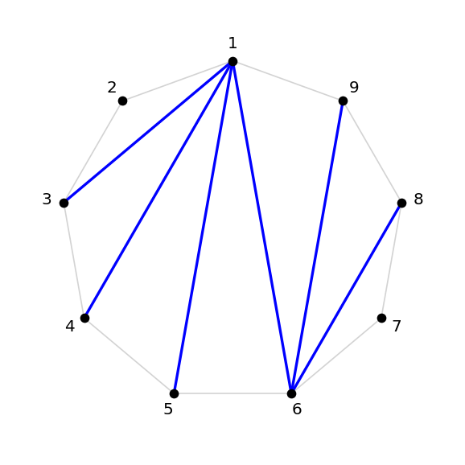


### Orbit 5
```
9-gon vertex layout (cyclic):
        1
    9       2
  8           3
  7           4
    6       5
        
Chords in T (with cyclic length):
    (1,3)  length = 2
    (1,4)  length = 3
    (1,5)  length = 4
    (1,6)  length = 4
    (6,9)  length = 3
    (7,9)  length = 2
Ear vertices (no chord touches): [2, 8]
```

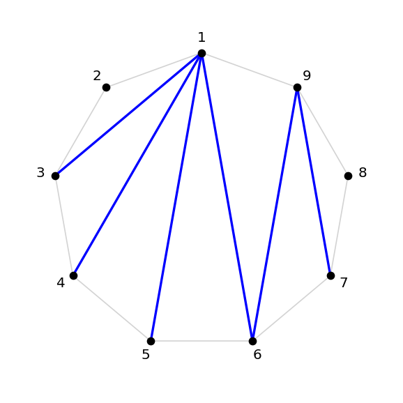


### Orbit 11
```
9-gon vertex layout (cyclic):
        1
    9       2
  8           3
  7           4
    6       5
        
Chords in T (with cyclic length):
    (1,3)  length = 2
    (1,4)  length = 3
    (1,5)  length = 4
    (5,8)  length = 3
    (5,9)  length = 4
    (6,8)  length = 2
Ear vertices (no chord touches): [2, 7]
```

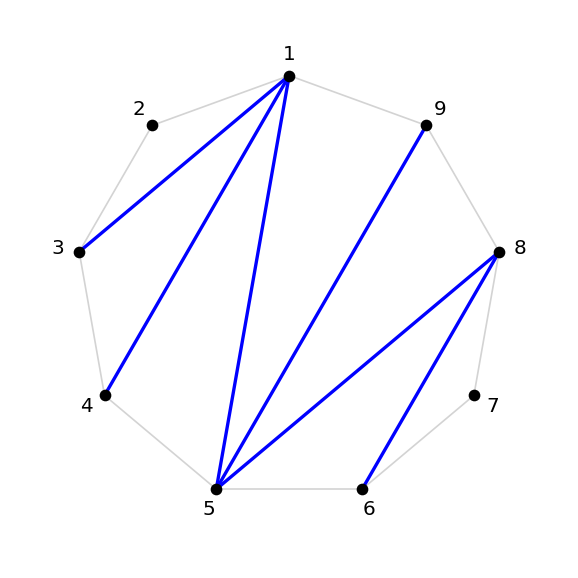


### Orbit 49
```
9-gon vertex layout (cyclic):
        1
    9       2
  8           3
  7           4
    6       5
        
Chords in T (with cyclic length):
    (1,3)  length = 2
    (3,9)  length = 3
    (4,7)  length = 3
    (4,8)  length = 4
    (4,9)  length = 4
    (5,7)  length = 2
Ear vertices (no chord touches): [2, 6]
```

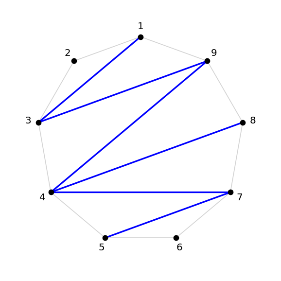


## Component 7

Orbits in component: **[12, 13, 32, 48]** (4 orbits)

### Triangulation orbit representatives

| Orbit ID | Rep (chord set) | Stabilizer order | Chord lengths | Ear vertices |
|---:|---|---:|---|---|
| 12 | {(1,3), (1,4), (1,5), (5,9), (6,8), (6,9)} | 1 | [2, 2, 3, 3, 4, 4] | [2, 7] |
| 13 | {(1,3), (1,4), (1,5), (5,9), (6,9), (7,9)} | 1 | [2, 2, 3, 3, 4, 4] | [2, 8] |
| 32 | {(1,3), (1,4), (4,9), (5,8), (5,9), (6,8)} | 1 | [2, 2, 3, 3, 4, 4] | [2, 7] |
| 48 | {(1,3), (3,8), (3,9), (4,7), (4,8), (5,7)} | 1 | [2, 2, 3, 3, 4, 4] | [2, 6] |

### Step-2 swap edges *within* component 7

Each row gives one orbit-level Step-2 edge: two triangulation orbits whose representatives are related by a single bare/special swap at some cyclic zone(s). Any two orbits in this component are linked by a chain of such edges.

| Orbit A | Orbit B | Sample triangulation pair (at zones) |
|---:|---:|---|
| 12 | 13 | `{(1,5),(1,6),(2,5),(3,5),(6,8),(6,9)}` ↔ `{(1,5),(1,6),(2,4),(2,5),(6,8),(6,9)}` (zones [3, 3]) |
| 12 | 32 | `{(1,6),(1,7),(2,5),(2,6),(3,5),(7,9)}` ↔ `{(1,6),(1,7),(2,4),(2,5),(2,6),(7,9)}` (zones [3, 3]) |
| 13 | 48 | `{(1,4),(2,4),(4,9),(5,7),(5,8),(5,9)}` ↔ `{(1,4),(2,4),(4,9),(5,8),(5,9),(6,8)}` (zones [6, 6]) |
| 32 | 48 | `{(1,3),(1,4),(4,9),(5,8),(5,9),(6,8)}` ↔ `{(1,4),(2,4),(4,9),(5,8),(5,9),(6,8)}` (zones [2, 2]) |

### Diagrams


### Orbit 12
```
9-gon vertex layout (cyclic):
        1
    9       2
  8           3
  7           4
    6       5
        
Chords in T (with cyclic length):
    (1,3)  length = 2
    (1,4)  length = 3
    (1,5)  length = 4
    (5,9)  length = 4
    (6,8)  length = 2
    (6,9)  length = 3
Ear vertices (no chord touches): [2, 7]
```

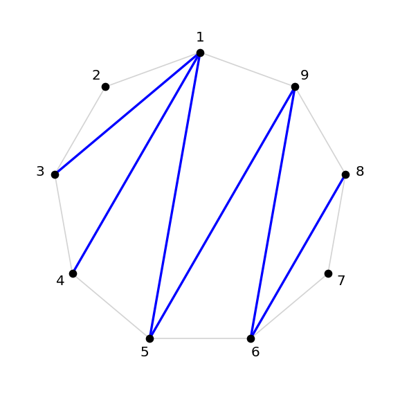


### Orbit 13
```
9-gon vertex layout (cyclic):
        1
    9       2
  8           3
  7           4
    6       5
        
Chords in T (with cyclic length):
    (1,3)  length = 2
    (1,4)  length = 3
    (1,5)  length = 4
    (5,9)  length = 4
    (6,9)  length = 3
    (7,9)  length = 2
Ear vertices (no chord touches): [2, 8]
```

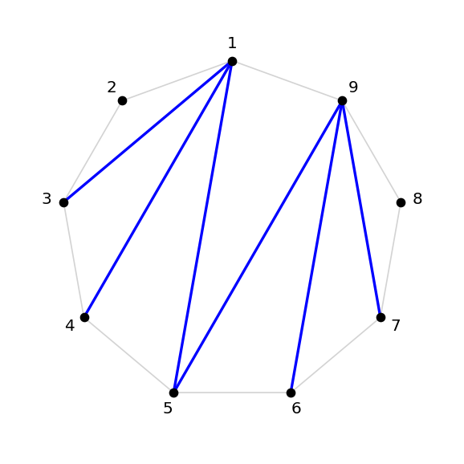


### Orbit 32
```
9-gon vertex layout (cyclic):
        1
    9       2
  8           3
  7           4
    6       5
        
Chords in T (with cyclic length):
    (1,3)  length = 2
    (1,4)  length = 3
    (4,9)  length = 4
    (5,8)  length = 3
    (5,9)  length = 4
    (6,8)  length = 2
Ear vertices (no chord touches): [2, 7]
```

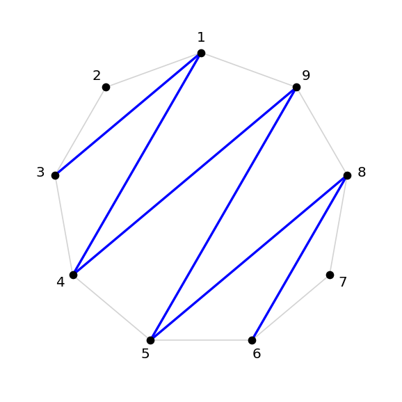


### Orbit 48
```
9-gon vertex layout (cyclic):
        1
    9       2
  8           3
  7           4
    6       5
        
Chords in T (with cyclic length):
    (1,3)  length = 2
    (3,8)  length = 4
    (3,9)  length = 3
    (4,7)  length = 3
    (4,8)  length = 4
    (5,7)  length = 2
Ear vertices (no chord touches): [2, 6]
```

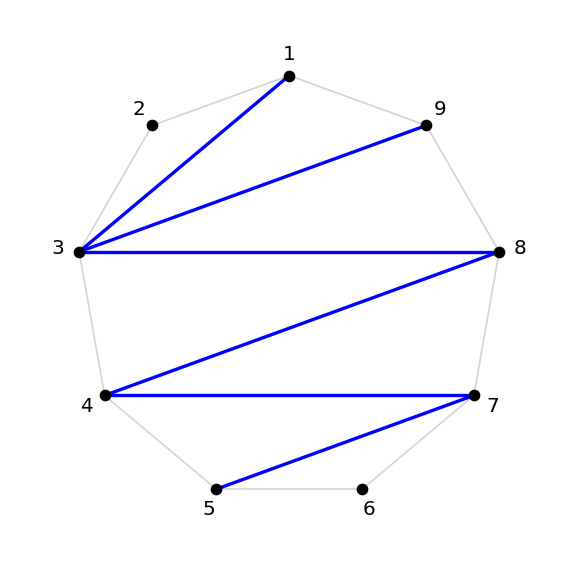


## Component 14

Orbits in component: **[29, 30, 33, 47]** (4 orbits)

### Triangulation orbit representatives

| Orbit ID | Rep (chord set) | Stabilizer order | Chord lengths | Ear vertices |
|---:|---|---:|---|---|
| 29 | {(1,3), (1,4), (4,8), (4,9), (5,7), (5,8)} | 1 | [2, 2, 3, 3, 4, 4] | [2, 6] |
| 30 | {(1,3), (1,4), (4,8), (4,9), (5,8), (6,8)} | 1 | [2, 2, 3, 3, 4, 4] | [2, 7] |
| 33 | {(1,3), (1,4), (4,9), (5,9), (6,9), (7,9)} | 1 | [2, 2, 3, 3, 4, 4] | [2, 8] |
| 47 | {(1,3), (3,7), (3,8), (3,9), (4,7), (5,7)} | 1 | [2, 2, 3, 3, 4, 4] | [2, 6] |

### Step-2 swap edges *within* component 14

Each row gives one orbit-level Step-2 edge: two triangulation orbits whose representatives are related by a single bare/special swap at some cyclic zone(s). Any two orbits in this component are linked by a chain of such edges.

| Orbit A | Orbit B | Sample triangulation pair (at zones) |
|---:|---:|---|
| 29 | 30 | `{(1,5),(2,4),(2,5),(5,9),(6,9),(7,9)}` ↔ `{(1,5),(2,4),(2,5),(5,9),(6,8),(6,9)}` (zones [7, 7]) |
| 29 | 33 | `{(1,6),(1,7),(2,6),(3,5),(3,6),(7,9)}` ↔ `{(1,6),(1,7),(2,6),(3,6),(4,6),(7,9)}` (zones [4, 4]) |
| 30 | 47 | `{(1,6),(1,7),(1,8),(2,6),(3,5),(3,6)}` ↔ `{(1,6),(1,7),(1,8),(2,6),(3,6),(4,6)}` (zones [4, 4]) |
| 33 | 47 | `{(1,8),(2,7),(2,8),(3,7),(4,7),(5,7)}` ↔ `{(2,7),(2,8),(2,9),(3,7),(4,7),(5,7)}` (zones [9, 9]) |

### Diagrams


### Orbit 29
```
9-gon vertex layout (cyclic):
        1
    9       2
  8           3
  7           4
    6       5
        
Chords in T (with cyclic length):
    (1,3)  length = 2
    (1,4)  length = 3
    (4,8)  length = 4
    (4,9)  length = 4
    (5,7)  length = 2
    (5,8)  length = 3
Ear vertices (no chord touches): [2, 6]
```

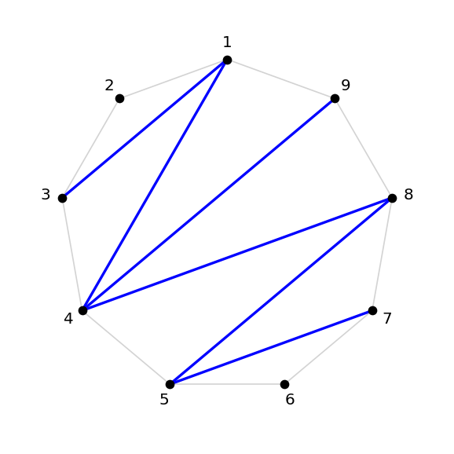


### Orbit 30
```
9-gon vertex layout (cyclic):
        1
    9       2
  8           3
  7           4
    6       5
        
Chords in T (with cyclic length):
    (1,3)  length = 2
    (1,4)  length = 3
    (4,8)  length = 4
    (4,9)  length = 4
    (5,8)  length = 3
    (6,8)  length = 2
Ear vertices (no chord touches): [2, 7]
```

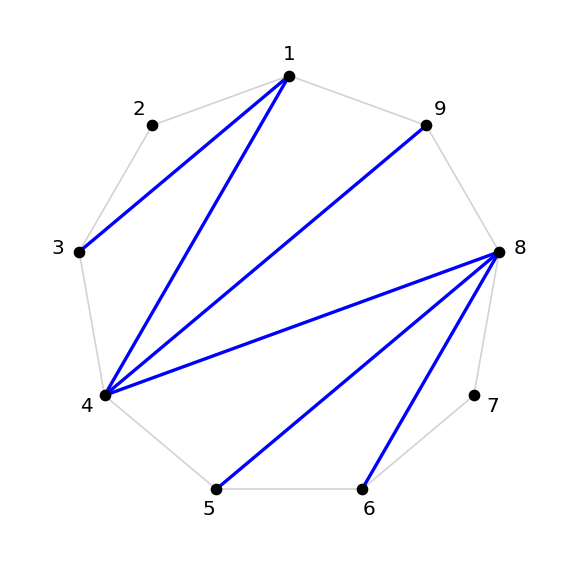


### Orbit 33
```
9-gon vertex layout (cyclic):
        1
    9       2
  8           3
  7           4
    6       5
        
Chords in T (with cyclic length):
    (1,3)  length = 2
    (1,4)  length = 3
    (4,9)  length = 4
    (5,9)  length = 4
    (6,9)  length = 3
    (7,9)  length = 2
Ear vertices (no chord touches): [2, 8]
```

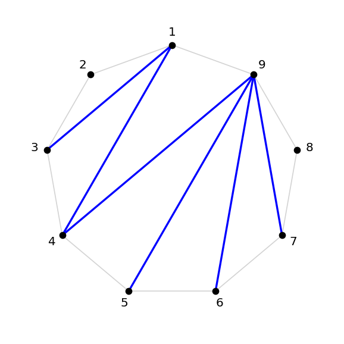


### Orbit 47
```
9-gon vertex layout (cyclic):
        1
    9       2
  8           3
  7           4
    6       5
        
Chords in T (with cyclic length):
    (1,3)  length = 2
    (3,7)  length = 4
    (3,8)  length = 4
    (3,9)  length = 3
    (4,7)  length = 3
    (5,7)  length = 2
Ear vertices (no chord touches): [2, 6]
```

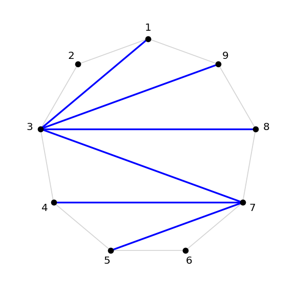


---

## Why these components are isolated

**Step 1 (layer-0 kill)** never touches triangulations at all (local-survival lemma: no triangulation is killable at any zone). So Step-1 contributes zero equations involving these orbits.

**Step 2 (bare/special swap on triangulations)** equates coefficients within each Step-2 component. By construction the 4 components above are CLOSED under this swap — every bare/special swap from any of their triangulations either stays in the same component or fails (the swapped multiset isn't a triangulation).

**Step 3 (block-rule cluster matrix at depth-1)** equates cluster non-tri coefficients to triangulation cousins via fingerprint equations. The 32 triangulation cousins from the cluster matrix land in 12 of the 16 components; these 4 components have NO triangulation cousin coupled to any of the 90 cluster orbits at depth-1.

**TEST 1 (depth-1 fingerprints from 23 non-cluster non-tri orbits)** also yields zero new bridges into these components.

Combined: every depth-1 hidden-zero relation either has all its triangulation cousins in the *other* 12 components, or has no triangulation cousins at all. The 4 untouched components are *invisible* to the depth-1 mechanism.

## What might bridge them

Possibilities for the missing mechanism, all using ONLY 1-zero hidden-zero conditions:
1. **Depth-2 (or deeper) Laurent fingerprints** that pull in triangulation cousins these depth-1 equations miss. (Test 2 in `build_bridges.py`.)
2. **Pure-triangulation Laurent extractions** — free-chord monomials at low order whose only contributors are triangulations, giving triangulation-only relations.
3. **Multi-bare Step-2 identities** — currently the swap exchanges one bare for one special; allowing multiple bare/special exchanges in a single multiset may produce new edges.


---

## Discriminating structural feature: chord-length signature [2,2,3,3,4,4]

The chord-length signature `(2,2,3,3,4,4)` is the **unique invariant** of
the 4 untouched components. Across all 16 Step-2 components:

| Step-2 component | # orbits | chord-length signature | touched? |
|---:|---:|---|---|
| **1**  | 4 | (2, 2, 3, 3, 4, 4) | **untouched** |
| 2  | 2 | (2, 2, 2, 3, 4, 4) | touched |
| **3**  | 4 | (2, 2, 3, 3, 4, 4) | **untouched** |
| 4  | 4 | (2, 2, 2, 3, 3, 4) | touched |
| 5  | 4 | (2, 2, 2, 3, 3, 4) | touched |
| 6  | 2 | (2, 2, 2, 3, 4, 4) | touched |
| **7**  | 4 | (2, 2, 3, 3, 4, 4) | **untouched** |
| 8  | 4 | (2, 2, 2, 3, 3, 4) | touched |
| 9  | 2 | (2, 2, 2, 2, 3, 4) | touched |
| 10 | 4 | (2, 2, 2, 3, 3, 3) | touched |
| 11 | 2 | (2, 2, 2, 2, 3, 4) | touched |
| 12 | 4 | (2, 2, 2, 3, 3, 4) | touched |
| 13 | 2 | (2, 2, 2, 3, 4, 4) | touched |
| **14** | 4 | (2, 2, 3, 3, 4, 4) | **untouched** |
| 15 | 2 | (2, 2, 2, 3, 4, 4) | touched |
| 16 | 1 | (2, 2, 2, 2, 4, 4) | touched |

(Possible chord lengths at $n=9$ are $\{2, 3, 4\}$ since the maximum
useful chord skips at most $\lfloor 9/2 \rfloor = 4$ vertices.)

The signature `(2,2,3,3,4,4)` is the **balanced / maximum-entropy
distribution**: two chords each of lengths 2, 3, 4. Every other Step-2
component has a *biased* signature — at least one length appears more
than twice, at the cost of another length appearing fewer than twice.

### Geometric interpretation

The fan triangulation from vertex $v$ has chords $(v, v+k)$ for
$k = 2, 3, \dots, n-2$, with cyclic lengths $\min(k, n-k)$. At $n=9$
this gives lengths $\{2, 3, 4, 4, 3, 2\} = (2,2,3,3,4,4)$. So **fan
triangulations** lie in the balanced components, and so do the
triangulations that Step-2 swaps connect to fans. Components 1, 3,
7, 14 are exactly these "fan-class" orbits.

### Why fan-class triangulations are isolated from depth-1 cluster equations

A step-1 survivor multiset $M$ at $n = 9$ must, at every cyclic zone
$\mathcal Z_{r, r+2}$, fail $(K1)$ or $(K2)$ — concretely, contain
the special $(r, r+2)$ (length 2) or the bare $(r-1, r+1)$ (length 2)
or a complete (companion, substitute) pair. So step-1 survivors are
**enriched in length-2 chords**.

A depth-1 fingerprint equation of $M$ has a triangulation cousin $T$
exactly when $T$ differs from $M$ by **one chord**. For $T$ to be
in a balanced [2,2,3,3,4,4] component, $M$'s chord-length multiset
would have to be one length-2 short (e.g. [2,3,3,4,4,X]) — but
step-1 survivors typically have *more* length-2 chords than that,
not fewer.

The 12 touched components have signatures with **3 or 4 length-2
chords** (e.g. (2,2,2,3,3,4) or (2,2,2,2,3,4)) — one chord-replacement
away from typical step-1 survivor structures. The 4 untouched
components have only **2 length-2 chords**, putting them too far
from any cluster non-tri or non-cluster non-tri orbit's depth-1
neighborhood.

### Why Step-1, Step-2, and Step-3 all fail to touch them

| Mechanism | Why it doesn't reach these 4 components |
|---|---|
| **Step 1** (layer-0 kill) | Triangulations are *never* step-1 killable (local-survival lemma). So Step-1 trivially gives no equations involving them. |
| **Step 2** (bare/special swap) | The swap exchanges $(r, r+2) \leftrightarrow (r-1, r+1)$ — both length-2 — so it preserves the chord-length signature. Two triangulations with different signatures are *never* swap-related, so the four (2,2,3,3,4,4) components are closed under Step-2 by construction. |
| **Step 3** (depth-1 cluster matrix) | A depth-1 fingerprint equation of a step-1 survivor $M$ has triangulation cousins $T = M \pm c$ for one chord $c$. The signature shift requires $M$'s signature to be exactly one chord away from balanced — but step-1 survivors have signatures biased toward length-2. So no balanced triangulation appears as a cousin. |

### What might bridge them, with 1-zero constraints only

1. **Depth-2 (or deeper) Laurent fingerprints.** Two-chord replacements
   can change the signature by 2 lengths at once, potentially landing
   on balanced triangulations. (TEST 2 in `build_bridges.py` is
   running now to check.)
2. **Pure-triangulation Laurent extractions.** Free-chord monomials at
   low orders whose only contributors are triangulations — these give
   triangulation-only relations (no step-1-killable cousins to
   subtract), which could connect [2,2,3,3,4,4] orbits directly to
   each other or to other components.
3. **Multi-bare Step-2 identities.** Allowing two simultaneous
   bare/special swaps in a single multiset may produce edges that the
   single-swap flip graph misses.
